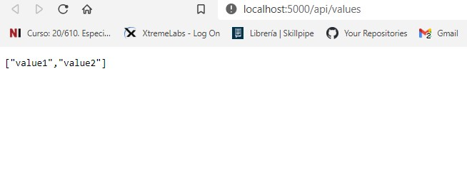

# Module 5: Hosting Services On-Premises and in Azure

# Lesson 1: Hosting Services On-Premises

### Demonstration: Hosting Services On-Premises by using Windows Services with Kestrel (RunAsService)

- Abrimos el proyecto HostInWindowsService en Visual Studio Code

- Restauramos el proyecto

- Publicamos como servicio

  ```bash
    dotnet publish --configuration Release --output [Repository Root]\Allfiles\Mod05\DemoFiles\HostInWindows Service
  ```

  

- Creamos el servicio en windows

  ```bash
  sc create HotelsService binPath= &quot;[Repository Root]\Allfiles\Mod05\DemoFiles\Host In Windows Service\BlueYonder.Hotels.Service.exe&quot;VV
  ```

- Verificamos que corre probando en el navegador  **http://localhost:5000/api/values**. 

  



- Paramos el servicio

  ```bash
  sc stop HotelsService
  ```

  